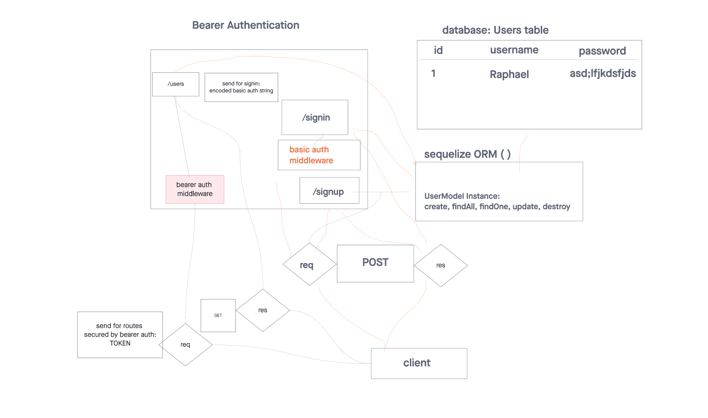

# Lab Class 07

## Project: Bearer-Authorization

Authentication Server Phase 2: Token (Bearer) Authentication

At this point, our auth-server is able to allow a user to create an account as well as to handle Basic Authentication (user provides a username + password). When a “good” login happens, the user is considered to be “authenticated” and our auth-server generates a JWT signed “Token” which is returned to the application

We will now be using that Token to re-authenticate users to shield access to any route that requires a valid login to access.

### Author: Raphael Chookagian

### Problem Domain

As a user, I want to create a new account so that I may later login
Using an HTTP REST client or a web form:
Make a POST request to the/signup route with username and password.
Your server should support both JSON and FORM data as input.
On a successful account creation, return a 201 status with the user object in the body.
On any error, trigger your error handler with an appropriate error.
As a user, I want to login to my account so that I may access protected information
Using am HTTP REST client, or a web form:
Make a POST request to the /signin route.
Send a basic authentication header with a properly encoded username and password combination.
On a successful account login, return a 200 status with the user object in the body.
On any error, trigger your error handler with the message “Invalid Login”.

As a user, I want to obtain a token after I signin, so that I can re-authenticate
Using an HTTP REST client, or a web form:
Following a POST to /signup to create an account (or) Following a POST to /signin with basic authorization
Send a response to the client with the proper status code along with an object with the following properties

        {
          user: {
            _id: 'ID FROM DB',
            username: 'myusername'
          },
          token: 'JWT Token Here'
        }

As a user, I want to use my token to access routes that require a valid user
Using an HTTP REST client, send a request to a “protected” route, such as /secretstuff
Your request must send an “Authorization” header, with the value of Bearer TOKEN
TOKEN is the token that you would have returned to the user after their signin step (above)
If the TOKEN is valid (i.e. if it represents an actual user)
The route should function as it normally would (sending a response)
If not
Send the user an error message stating “Invalid Login”
As the website owner, I want our token system to be as secure as possible so that our users can feel safe when logging in
Research ways to “secure” our JWT Tokens
Implement one or more methods to secure our login tokens

### Links and Resources

- [ci,cd](https://github.com/cesarderio/basic-auth)
<!-- - [prod deployment](https://basic-auth-tg63.onrender.com) -->
<!-- - [dev deployment](https://basic-auth-dev-6rxb.onrender.com/) -->

### Setup

### `.env` requirements

see `.env.sample`

i.e.

- `PORT`
- `DATABASE_URL` - URL to the running Postgres instance/db

#### How to initialize/run your application (where applicable)

- nodemon

#### Features / Routes

- Feature One: Details of feature
- GET : `/` - specific route to hit
- GET : `/users` - specific route to hit
- GET : `bad` - specific route to hit

#### Tests

- How do you run tests?
  - npm test
- Any tests of note?
  - validator
  - logger
  - handles root path
  - handles errors
  handles invalid requests

- 404 on a bad route
- 404 on a bad method

The correct status codes and returned data for each REST route:

<!-- - Create a record using POST
- Read a list of records using GET
- Read a record using GET
- Update a record using PUT
- Destroy a record using DELETE -->

### Whiteboard

#### UML

## Terminology

- Query Parameter: `/person?name=Raphael`
- Path (URL) Parameter: `/person/name`
-
